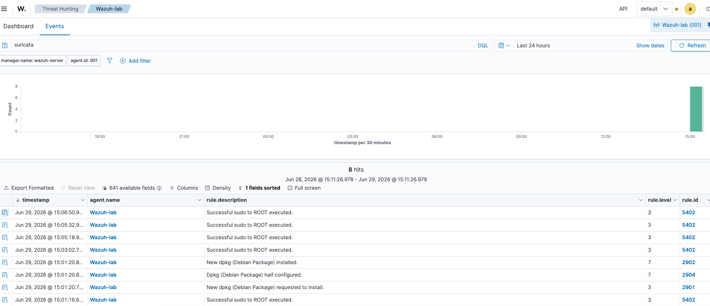
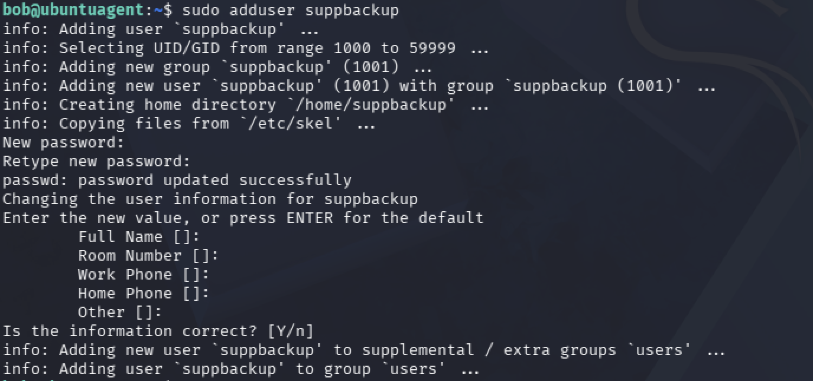

# Wazuh SIEM Threat Detection and Triage Lab

## Overview

The purpose of this project was to build a SOC monitoring and investigation lab capable of detecting, monitoring, and analyzing common attacker techniques. Using Wazuh SIEM, Suricata IDS, Ubuntu Server, and Kali Linux, I simulated real-world attack scenarios and investigated the resulting security events from a defender's perspective and ways to triage them.

## Lab Architecture

- Ubuntu Server (Wazuh Manager + Dashboard)
- Kali Linux (Attacker)
- Ubuntu Server (Monitored Endpoint with Wazuh Agent)

## Technologies Used

**SIEM & Security Monitoring**
- Wazuh SIEM
- Suricata IDS
- Operating Systems
- Ubuntu Server
- Kali Linux
- Linux

**Offensive Security & Attack Simulation**
- Hydra (SSH Brute Force)
- Nmap (Network Reconnaissance)

**Protocols & Services**
- SSH
- Sudo

--- 

## Security Concepts Demonstrated
- SSH Brute Force Detection
- Authentication Monitoring
- File Integrity Monitoring (FIM)
- Network Reconnaissance Detection
- Privilege Escalation Detection
- User Account Monitoring
- Security Event Investigation
- Threat Detection
- Log Analysis

## Skills Used 

-Built and configured a multi-VM Security Operations Center (SOC) lab consisting of a Wazuh Manager, Ubuntu endpoint, and Kali Linux attacker to simulate enterprise security monitoring.

-Investigated security events generated by Wazuh SIEM analyzing authentication logs, endpoint telemetry, Suricata IDS alerts, and Linux audit logs to identify suspicious activity and validate detections.

-Simulated SSH brute-force attacks using Hydra and analyzed failed authentication attempts, successful logins, source IP addresses, and event timelines within the Wazuh Dashboard.

-Conducted threat hunting by correlating endpoint and network telemetry to identify reconnaissance activity, privilege escalation attempts, and user account management events.

-Analyzed Suricata IDS alerts generated from Nmap reconnaissance scans to validate intrusion detection and assess attacker behavior.

-Validated File Integrity Monitoring (FIM) by creating, modifying, and deleting monitored files while verifying Wazuh's detection of unauthorized file system changes.

-Investigated Linux privilege escalation and user account creation events by reviewing Wazuh alerts and system logs to confirm security-relevant administrative activity.

## Lab Demonstrations

### SSH Authentication Failure and Success

I used Hydra from my Kali Linux VM to perform an SSH brute-force attack against my Ubuntu endpoint. Wazuh detected the repeated failed login attempts and generated authentication alerts, which I investigated through the Wazuh Dashboard to analyze the attack activity.

In a separate scenario, I successfully authenticated to the Ubuntu endpoint over SSH to simulate an attacker obtaining valid credentials. Wazuh generated a successful authentication event that included the source IP address, username, and login details. This information is valuable during a security event investigation because it allows analysts to identify where the connection originated, determine whether the login is expected or suspicious, and establish a timeline of attacker activity.

**Hydra Simulation Kali Perspective**

**Wazuh Authentication Alerts**

**Successful SSH Login Detected**

 

<strong>Hydra Brute Force Triage Workflow</strong>
                                                                          

  - Review the alert severity and rule triggered.
- Identify the source IP address and targeted username.
- Count the number of failed authentication attempts.
- Determine whether multiple usernames were targeted.
- Review successful login events following the failures.
- Correlate the source IP with firewall or network logs.
- Determine whether the activity originated from an authorized system.
- Escalate if successful authentication occurred after repeated failures.
- Recommend blocking the source IP and resetting compromised credentials if necessary.

 

<strong>Successful Authentication Log in Triage Workflow</strong>
 

- Verify the username that authenticated.
- Identify the source IP address.
- Determine whether the login occurred during expected hours.
- Review authentication history for previous failed attempts.
- Check for privilege escalation following login.
- Review commands executed after authentication.
- Determine whether the source host is trusted.
- Escalate if the login appears suspicious or follows brute-force activity.

  
---

### File Integrity Monitoring

To test File Integrity Monitoring (FIM), I created, modified, and deleted files on the Ubuntu endpoint. Wazuh detected each file system change and generated alerts detailing the affected files and directories, demonstrating its ability to identify unauthorized modifications to monitored resources. Depending if the victim practices bad security standards very valuable information that is stored recklessly can be removed, stolen, and modified.

This capability is critical because attackers who gain access to a system often attempt to modify, delete, or introduce malicious files to establish persistence, execute malware, tamper with logs, and even compromise sensitive data. File Integrity Monitoring helps security analysts quickly detect these unauthorized changes and investigate potential security incidents. 

**FIM Events**

**FIM Kali Perspective**

<strong>File Integrity Monitoring Triage Workflow</strong>

- Identify the affected file or directory.
- Determine whether the change was expected.
- Identify which user performed the modification.
- Review surrounding authentication logs.
- Determine whether multiple files were modified.
- Check for execution of newly created files.
- Look for evidence of persistence or malware.
- Escalate if sensitive system files were altered.

---

### Network Reconnaissance

I performed an Nmap scan from my Kali Linux VM against the Ubuntu endpoint to simulate network reconnaissance activity. Suricata detected the scan and forwarded the alert to Wazuh, where I investigated the event through the Wazuh Dashboard. The alert provided details such as the source IP address, destination host, and signature identifying the reconnaissance activity, allowing me to validate the detection and assess potential pre-attack behavior. 

Detecting reconnaissance is important because attackers often use port scanning as a first step to identify open services and potential attack vectors before attempting to exploit a target.

**Suricata Nmap Alert**

 

<strong>Network Reconnaissance Triage Workflow</strong>
 

- Review the IDS signature.
- Identify the source IP address.
- Determine the destination host.
- Review which ports were scanned.
- Check for additional alerts from the same IP.
- Determine whether exploitation attempts followed the scan.
- Correlate with firewall logs.
- Recommend blocking the source if unauthorized.

---

### Privilege Escalation

I simulated privilege escalation by using sudo to elevate my privileges on the Ubuntu endpoint. Wazuh detected the successful elevation to the root account and generated a security event, which I investigated through the Wazuh Dashboard. The alert captured details about the privileged command execution and user account involved, allowing me to verify the activity and understand how elevated privileges are monitored. 

Finding privilege escalation is essential because attackers attempt to gain administrative access after compromising a system, enabling them to execute unauthorized commands, modify system configurations, establish persistence, and access sensitive data.

**Privilege Escalation Alert**

 

<strong>Privilege Escalation Workflow Triage</strong>
 

- Identify the user account.
- Review the executed command.
- Determine whether elevation was authorized.
- Check authentication logs leading up to the event.
- Review subsequent privileged commands.
- Look for new users, services, or scheduled tasks.
- Review changes to critical system files.
- Escalate if privilege escalation was unexpected.

 
---

### User Account Creation

To simulate account management activity, I created a local Linux user from the Kali Linux attacker VM after establishing access to the Ubuntu endpoint. Wazuh detected both actions and generated security events, which I investigated through the Wazuh Dashboard to verify the account changes and associated system activity. 

Monitoring account management events helps security analysts identify unauthorized account creation or deletion that may indicate persistence, privilege escalation, or other post-compromise activity.

**User Creation Alert**

 

**Kali Perspective** 

<strong>Account Creation Triage Workflow</strong>

- Identify the account that was created or removed.
- Determine which administrator performed the action.
- Verify whether the change was authorized.
- Review recent authentication activity.
- Check whether the account was added to privileged groups.
- Review login activity for the new account.
- Look for related persistence techniques.
- Escalate if the account was unauthorized.

  
---

# What I Learned

Building this lab allowed me to apply concepts I had previously learned through coursework in realistic scenarios. Setting up multiple Vms to mimic an environment, configuring Wazuh, integrating Suricata, and simulating attacks from a Kali Linux VM gave me hands-on experience with security monitoring and event analysis.

Working through each scenario helped me understand how attacker activity is detected across endpoint and network telemetry, how to investigate alerts using log data, and how to triage security events by validating suspicious activity and correlating related evidence.

This project also strengthened my Linux administration skills through user management, file system monitoring, service configuration, and troubleshooting.

Overall, the lab gave me practical experience with SIEM technologies, threat detection, security event investigation, and reinforced the importance of understanding cybersecurity from both the attacker and defender perspectives.
